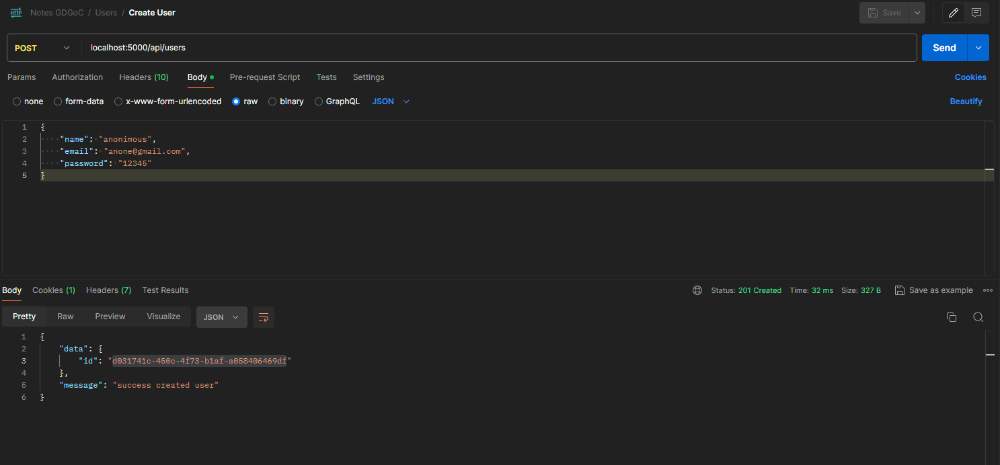
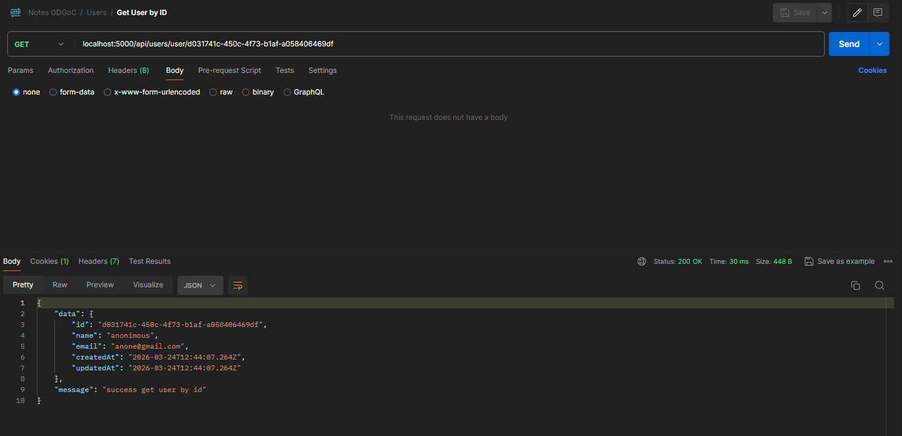
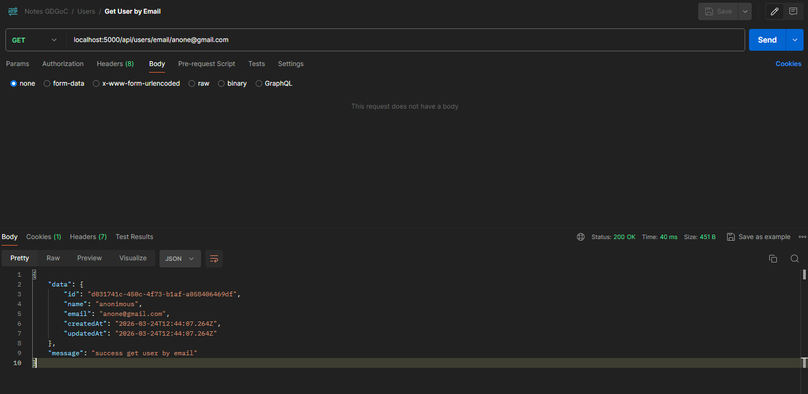
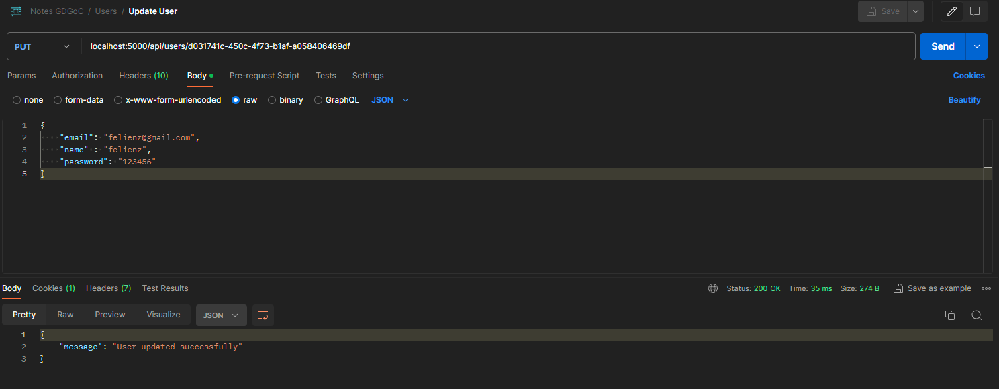
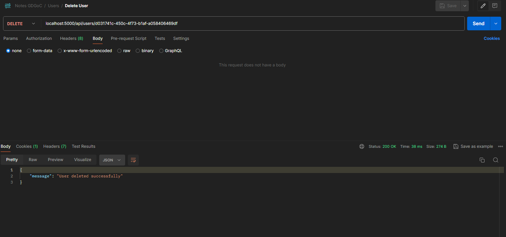
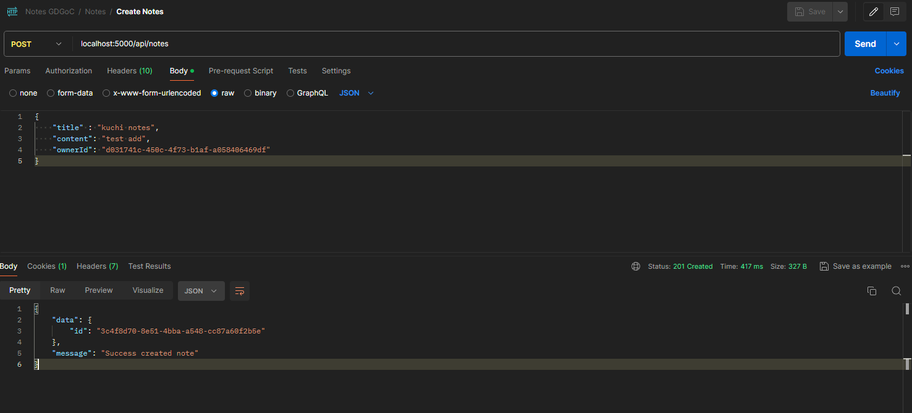
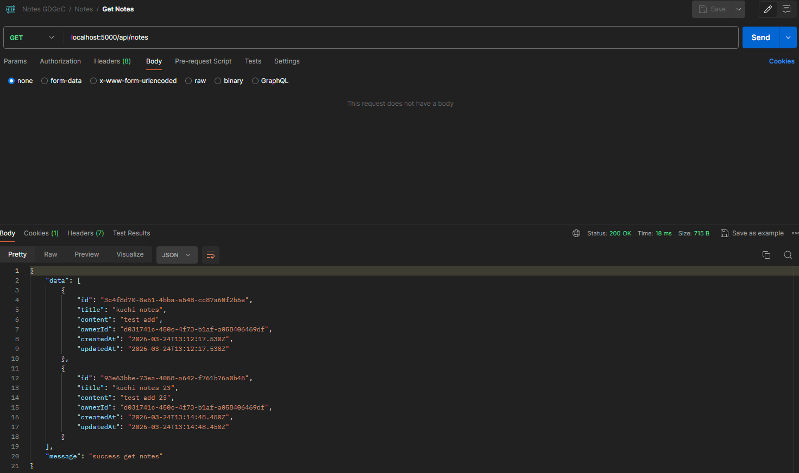
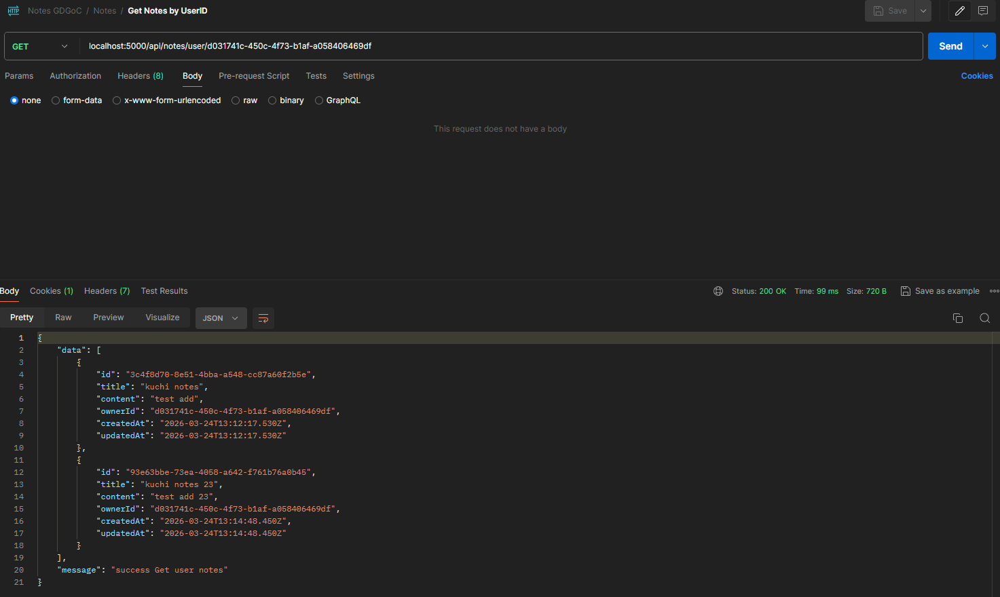
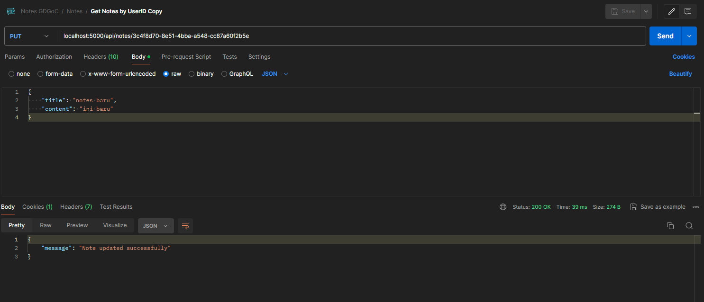
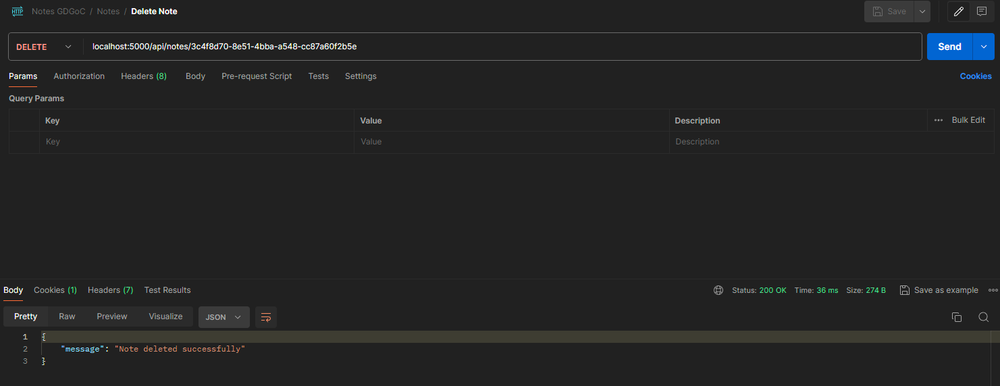

# Submission Backend 1 Rajab - FelienZ

Submission backend Node.js + Express yang dibangun menggunakan TypeScript dan PostgreSQL Untuk demonstrasi Git & Docker.

## 📋 Prerequisites

Sebelum menjalankan proyek ini, pastikan Anda telah memiliki:

- **Node.js** (v18 atau lebih baru)
- **npm** (Bawaan dari Node.js)
- **PostgreSQL Server** (Untuk database lokal, jika tidak menggunakan Docker)
- **Docker & Docker Compose** (Opsional, sangat disarankan untuk kemudahan deployment)

## 🚀 Quick Start Project

### 1. Clone Repository

```bash
git clone <url-repo-anda>
cd BE_Submission1
```

### 2. Install Dependencies

```bash
npm install
```

### 3. Setup Environment Variables

Buat file `.env` pada direktori _root_ (utama) proyek. Anda dapat menyalin konfigurasi dari `.env.example`:

```env
# Application Settings
APP_PORT=5000
APP_HOST=localhost # Gunakan 'localhost' jika DB di container, '0.0.0.0' jika app jalan via Docker

# Database Settings (PostgreSQL)
PGHOST=localhost
PGPORT=5433
PGUSER=ambatron
PGPASSWORD=gaklogis
PGDATABASE=namadb
```

### 4. Setup Database & Migration (Tanpa Docker)

Pastikan server PostgreSQL Anda berjalan. Lalu, jalankan skrip migrasi untuk membuat tabel:

```bash
npm run migrate up
```

### 5. Menjalankan Server

Karena menggunakan TypeScript, Anda harus meng-compile kode terlebih dahulu:

```bash
# Compile TypeScript ke JavaScript
npm run build

# Menjalankan server development (auto-reload)
npm run dev

# Menjalankan server production
npm start
```

---

## 🐳 Setup Docker

Proyek ini sudah dilengkapi dengan konfigurasi Docker untuk mempermudah _deployment_ dan integrasi database secara otomatis. Berikut adalah penjelasan minimalis terkait konfigurasi Docker yang digunakan:

### 1. `Dockerfile`

Digunakan untuk membangun _image_ aplikasi. Konfigurasinya dibuat ringan dengan `node:lts-alpine`. Image ini secara otomatis akan menjalankan `npm install`, memicu kompilasi TypeScript dengan `npm run build`, mengekspos `APP_PORT` (5000), dan menjalankan aplikasinya (`node ./dist/index.js`).

### 2. `docker-compose.yml`

Digunakan untuk menjalankan aplikasi dan database dalam satu kesatuan. Mengandung dua _service_:

- **`db`**: Menggunakan basis _image_ PostgreSQL (`14.22-trixie`). Konfigurasi kredensial databasenya secara otomatis ditarik dari kolom PostgreSQL pada file `.env`. Selain itu, data disave secara permanen dalam direktori volume lokal (`notes_db_data`).
- **`app`**: Melakukan build pada kode sumber kita berdasarkan `Dockerfile`. Pada kontainer ini, variabel `PGHOST` otomatis menyesuaikan diri menjadi `db` (menunjuk ke container database) sehingga menghubungkan aplikasi dan basis datanya menjadi seamless.

### 3. `.dockerignore`

Pengecualian spesifik direktori dan _file_ (`node_modules`, `dist`, `.env`, dll). File-file ini dicegah masuk ke dalam _image_ Docker karena akan di-generate/digunakan secara run-time oleh docker itu sendiri.

### 4. `init.sql` (Inisialisasi Database)

Jika database dijalankan melalui Docker, Anda dapat membuat skrip _auto-run_ SQL untuk dijalankan ketika pertama kali container Database diinisialisasi. Sebenarnya tahap ini boleh diskip asal ketika connect pakai Postgres User sesuai yang dibuat di env karena itu adalah ownernya.

Buat file bernama `init.sql` (Anda bisa merujuk ke file kosong `init.sql.example`), contoh:

```sql
-- init.sql
-- Tulis perintah sql default di sini (Opsional, misal jika tidak pakai migrasi npm)
-- CREATE TABLE public.users (...);
```

_(File SQL ini akan ter-mount otomatis ke dalam direktori entrypoint bawaan image Postgres)_.

### ▶️ Cara Menjalankan Aplikasi dengan Docker

Pastikan `.env` sudah dimodifikasi sesuai kebutuhan, lalu Anda hanya perlu menjalankan:

```bash
docker-compose up -d --build
```

Aplikasi akan secara otomatis ter-build dan bisa diakses di `http://localhost:5000`.

---

## 📦 Script yang Tersedia

| Command            | Deskripsi                                          |
| ------------------ | -------------------------------------------------- |
| `npm run dev`      | Start server dengan auto-reload (development)      |
| `npm run build`    | Compile TypeScript ke JavaScript (folder `dist/`)  |
| `npm start`        | Start server mode production (harus di-build dulu) |
| `npm run lint`     | Menjalankan ESLint                                 |
| `npm run lint:fix` | Menjalankan ESLint dan otomatis memperbaiki kode   |
| `npm run migrate`  | Menjalankan migrasi database (`node-pg-migrate`)   |

## 🏗️ Struktur Proyek

```text
BE_Submission1/
├── src/
│   ├── controllers/         # Request handler (UserHandler, NoteHandler)
│   ├── models/              # Entity / Struktur tabel
│   ├── repo/                # Repository (Query DB: UserRepo, NoteRepo)
│   ├── routes/              # Definisi Endpoint API (UserRoutes, NoteRoutes)
│   ├── services/            # Business logic (UserServices, NoteServices)
│   └── index.ts             # File utama Express server
├── package.json
├── docker-compose.yml       # Konfigurasi orchestrator container
├── Dockerfile               # File build image server APP
├── .env.example             # Template environment variable
├── init.sql.example         # Template inisialisasi query database Docker
└── README.md
```

## 🔑 Endpoint API

### Default

- `GET /` - Health check & Response JSON (response: {message: 'yoi'})

### Users (`/api/users`)

- `POST /api/users/` - Membuat user baru
- `GET /api/users/user/:userId` - Mengambil detail user berdasarkan ID
- `GET /api/users/email/:email` - Mengambil detail user berdasarkan email
- `PUT /api/users/:userId` - Mengedit data user
- `DELETE /api/users/:userId` - Menghapus user

### Notes (`/api/notes`)

- `GET /api/notes/` - Mengambil semua catatan (notes)
- `GET /api/notes/:noteId` - Mengambil catatan berdasarkan ID
- `GET /api/notes/user/:userId` - Mengambil seluruh catatan milik spesifik user
- `POST /api/notes/` - Membuat catatan baru
- `PUT /api/notes/:noteId` - Mengedit catatan
- `DELETE /api/notes/:noteId` - Menghapus catatan

---

## 📸 Lampiran: Hasil Testing Postman

Berikut adalah screenshot hasil _testing_ operasional API yang dieksekusi melalui aplikasi Postman.

### Endpoint Users

**1. Create User (POST `/api/users`)**

> Berhasil melakukan operasi pembuatan akun pengguna baru ke dalam database.
> 

---

**2. Get User By ID (GET `/api/users/user/:userid`)**

> Berhasil memanggil dan menampilkan data atribut pengguna.
> 

---

---

**3. Get User By Email (GET `/api/users/email/:email`)**

> Berhasil memanggil dan menampilkan data atribut pengguna.
> 

---

**4. Update/Delete User (PUT/DELETE `/api/users/:userId`)**

> Berhasil memanipulasi data pengguna (Hapus / Modifikasi).
> [Update Testing]
> 
> [Delete Testing]
> 

---

### Endpoint Notes

**5. Create Note (POST `/api/notes/`)**

> Berhasil merangkai payload untuk menambahkan data catatan baru.
> 

---

**6. Get Notes (GET `/api/notes/`)**

> Berhasil mengembalikan _list_ catatan dengan lancar.
> 

---

**7. Get Notes by UserID (GET `/api/notes/user/:userid`)**

> Berhasil mengembalikan _list_ catatan dengan lancar.
> 

---

**8. Get Notes by ID (GET `/api/notes/:noteid`)**

> Berhasil mengembalikan _list_ catatan dengan lancar.
> 

---

**9. Update/Delete Note (PUT/DELETE `/api/notes/:noteId`)**

> Berhasil mengatur siklus hidup catatan pada database (Hapus / Modifikasi).
> 
> 

---

## 🛠️ Tech Stack

| Teknologi             | Kegunaan                            |
| --------------------- | ----------------------------------- |
| **Node.js & Express** | Node.js Web Framework Backend       |
| **TypeScript**        | Type safety for javascript codebase |
| **PostgreSQL (`pg`)** | Postgres Relational Database Driver |
| **node-pg-migrate**   | Postgres Migration Tool             |
| **Docker**            | Containerization for app & database |

---

📝 **2026. Created By FelienZ**
